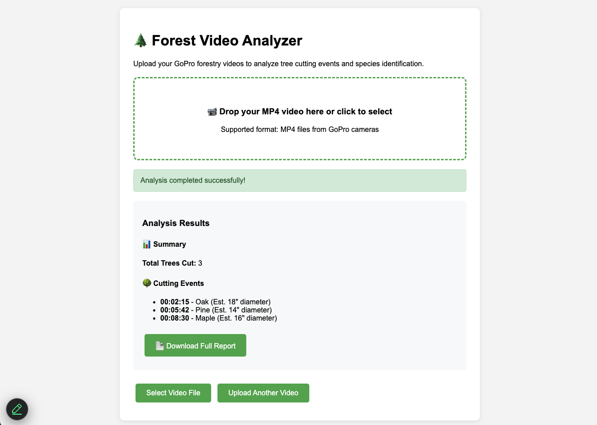

# Forest Video Analyzer

AWS serverless application for analyzing GoPro forestry videos using AWS Bedrock TwelveLabs Pegasus AI to identify tree cutting events and species.

## Quick Start

1. **Deploy the application:**
   ```bash
   ./deploy.sh
   ```

2. **Test the deployment:**
   ```bash
   ./quick-test.sh    # Basic API tests
   ./test.sh          # Comprehensive end-to-end tests
   ```

3. **AI analysis is automatic** - no API keys needed (uses AWS Bedrock)

4. **Access the web interface** at the URL provided after deployment

## Features

- **Simple drag-and-drop interface** for video uploads
- **AI-powered analysis** using AWS Bedrock TwelveLabs Pegasus
- **Multipart upload support** for large video files (>100MB)
- **Tree cutting event detection** with timestamps
- **Species identification** for cut trees (Birch, Oak, Pine, Maple, etc.)
- **Text report generation** with downloadable results
- **Real-time processing status** updates
- **Comprehensive testing suite** for validation
- **Serverless architecture** with automatic scaling

## Architecture

- **Frontend**: S3-hosted static website with vanilla JavaScript
- **Backend**: AWS Lambda functions with Python
- **Storage**: S3 for videos/reports, DynamoDB for job tracking
- **AI**: AWS Bedrock TwelveLabs Pegasus for video analysis
- **API**: API Gateway for REST endpoints

## File Structure

```
├── ARCHITECTURE.md          # Detailed architecture documentation
├── infrastructure-complete.yaml  # Complete CloudFormation template
├── deploy.sh               # Deployment script
├── test.sh                 # Comprehensive test suite
├── quick-test.sh          # Quick API validation
├── frontend/
│   └── index.html          # Web interface
└── .venv/                  # Python virtual environment
```

## Usage

1. Upload MP4 video file via web interface
2. Wait for AI processing (typically 2-5 minutes)
3. Download generated text report with:
   - Total trees cut
   - Timestamps of cutting events
   - Species identification
   - Estimated diameters

## Sample Report Output

```
FOREST HARVESTING REPORT
========================
Video: birch_cutting.mp4
Date: 2026-01-04 05:35:00 UTC
Analysis: AWS Bedrock TwelveLabs Pegasus AI

SUMMARY
-------
Total Trees Cut: 1

CUTTING EVENTS
--------------
1. 00:35 - Birch (Est. 12" diameter)

--- End of Report ---
```

## Testing

### Quick Test
```bash
./quick-test.sh
```
Tests basic API functionality and endpoint availability.

### Comprehensive Test
```bash
./test.sh
```
Full end-to-end test including:
- API Gateway health checks
- Upload functionality (presigned URLs)
- Video upload to S3
- Automatic processing trigger
- Status checking and polling
- Report generation and download
- DynamoDB integration
- Cleanup

### Manual Testing
1. Visit the web interface URL (provided after deployment)
2. Upload an MP4 video file
3. Monitor processing status
4. Download the generated report

## Troubleshooting

- **Upload fails**: Check S3 bucket permissions
- **Processing stuck**: Check CloudWatch logs for Bedrock errors
- **No results**: Check CloudWatch logs for errors
- **Website not loading**: Verify S3 bucket policy
- **Tests failing**: Run `./test.sh` for detailed diagnostics

## Monitoring

View processing logs:
```bash
aws logs tail /aws/lambda/forest-video-processor --follow
```

Check job status:
```bash
aws dynamodb scan --table-name forest-processing-results
```
